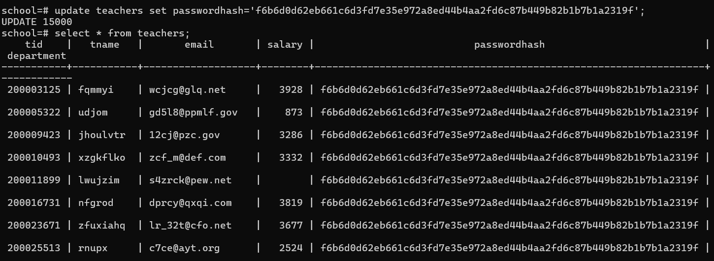
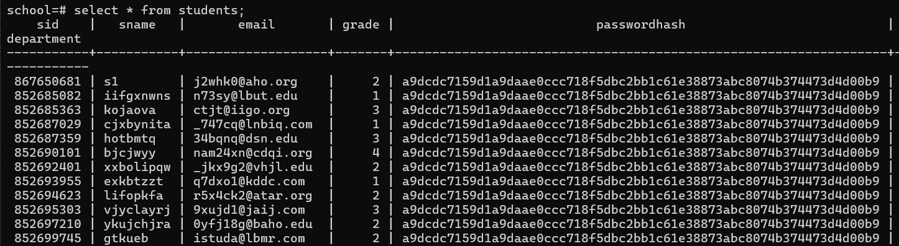

1. 更新 grade 列的 SQL 语句
以下 SQL 语句将 students 表中的 grade 列更新为 1 到 4 之间的随机整数：

sql
复制
UPDATE students
SET grade = FLOOR(random() * 4 + 1);
解释：
random()：生成一个 0 到 1 之间的随机小数。

random() * 4：将随机数范围扩展到 0 到 4 之间。

FLOOR(random() * 4 + 1)：将结果向下取整并加 1，确保最终值为 1 到 4 之间的整数。

2. 验证更新结果
更新后，可以使用以下 SQL 语句验证 grade 列的值是否在 1 到 4 之间：

sql
复制
SELECT sid, sname, grade
FROM students;
示例输出：
sid	sname	grade
123456789	John Doe	3
987654321	Jane Smith	1
567890123	Alice Brown	4
3. 确保 grade 列的约束
为了确保 grade 列的值始终在 1 到 4 之间，可以在表中添加一个检查约束：

sql
复制
ALTER TABLE students
ADD CONSTRAINT grade_check CHECK (grade >= 1 AND grade <= 4);
解释：
CHECK (grade >= 1 AND grade <= 4)：确保 grade 列的值在 1 到 4 之间。

如果插入或更新的值不符合约束条件，PostgreSQL 会抛出错误。

courses表：
UPDATE courses
SET grade = FLOOR(random() * 4 + 1);
ALTER TABLE courses
ADD CONSTRAINT leastgrade_check CHECK (leastgrade >= 1 AND leastgrade <= 4);

CREATE TABLE administrators (
    aid SERIAL PRIMARY KEY,
    passwordhash CHAR(64) NOT NULL
);
1. 使用 ALTER TABLE 添加列
首先，使用 ALTER TABLE 语句向 courses 表添加 credit 列：

sql
复制
ALTER TABLE courses
ADD COLUMN credit INTEGER;
2. 添加约束确保值在 1 到 5 之间
为了确保 credit 列的值在 1 到 5 之间，可以使用 CHECK 约束：

sql
复制
ALTER TABLE courses
ADD CONSTRAINT credit_range_check
CHECK (credit >= 1 AND credit <= 5);
3. 设置默认值（可选）
如果需要为 credit 列设置默认值（例如默认值为 1），可以在添加列时指定：

sql
复制
ALTER TABLE courses
add CONSTRAINT credit_range_check CHECK (credit >= 1 AND credit <= 5);
4. 更新现有数据（可选）
如果 courses 表中已经有数据，可以为现有的行设置 credit 列的默认值。例如，将所有现有行的 credit 设置为 1：

sql
复制
UPDATE courses
SET credit = 1
WHERE credit IS NULL;
5. 验证操作
完成上述操作后，可以通过以下方式验证是否成功：

查看表结构：

sql
复制
\d courses
检查 credit 列是否已添加，并且是否有 CHECK 约束。

插入数据测试：
尝试插入一个 credit 值在 1 到 5 之间的记录：

sql
复制
INSERT INTO courses (cid, cname, hour, leastgrade, tname, tid, credit)
VALUES (1, 'Mathematics', 40, 1, 'John Doe', 101, 3);
尝试插入一个 credit 值不在 1 到 5 之间的记录（应该会报错）：

sql
复制
INSERT INTO courses (cid, cname, hour, leastgrade, tname, tid, credit)
VALUES (2, 'Physics', 30, 1, 'Jane Smith', 102, 6);

UPDATE courses
SET credit = FLOOR(random() * 5 + 1);